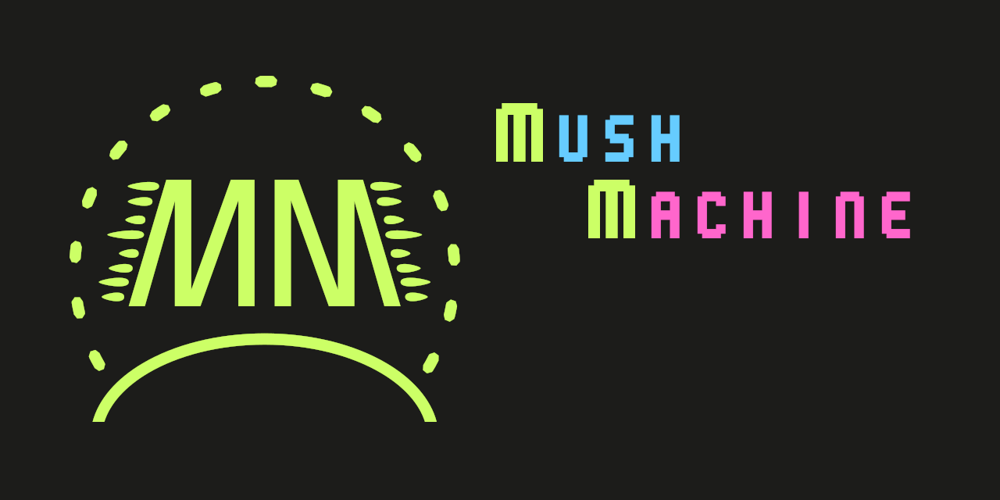

# MushMachine
This is a Game Engine/Framework, originally developed for GH**deducted** (a 2D game), but has since expanded its scope to be more generic. For example it also includes 3D stuff, instead of just 2D. Furthermore it got stripped of some dependency heavy dependencies (yea that's a thing).

The initial Developers are Erik Scholz and Felix Richter.
Currently developed and maintained by Erik Scholz.

The private repo had over 900 commits, before the first public release.

## Links
- [Gitlab](https://gitlab.com/MadeOfJelly/MushMachine)
- [Github](https://github.com/MadeOfJelly/MushMachine)
- [Setup](docs/setup.md)
- [Example Game Setup](docs/basic_game.md)
- The [Docs Directory](docs/) contains Documentation loosly based on the Source structure.

## Platforms
- PC (Linux, Windows and maybe APPLE(untested))
- Android (untested)
- Web (huh? yea! via Emscripten, wasm and WebGL2)
- anything if you put your mind to it....
- Rendering wise, only Opengl3.3/ES3 is included in the Engine

## Roadmap
- Rewrite the Input service (the code was ported in and is older than the Engine (2017))
- Extend the SDL service with Vulkan support (it's 2020 so yea)
- Filesystem refactor (like a proper file type, with destructor and stuff)
- l10n support
- ImGui integration refactor (for making it usable as a game ui, not just for debugging)
- more service interfaces (with focus on networking)
- multithreading updates (maybe a jobsystem idk)

## Limitations
- Features in general. It's more of a Personal Framework than something I want everyone to use ;).
- Only ships where OpenGL 3.3 or OpenGL ES 3 are available (includes web via Emscripten's ES3 emulation)
- not optimized for performance
- no multithreading in the Engine itself
- basically most of the Roadmap fits here too

## License

MIT you bet

## Source Structure

- framework (where most of the code lives)
- systems (some prepackaged [ecs-systems](docs/terminology.md) )
- screens (some prepackaged [`MM::Screen`s](docs/terminology.md) )

## Libraries Used
- [EnTT](https://github.com/skypjack/entt)
- [glad](https://github.com/Dav1dde/glad)
- [GLM](https://github.com/g-truc/glm)
- [googletest](https://github.com/google/googletest)
- [IconFontCppHeaders](https://github.com/juliettef/IconFontCppHeaders)
- [Dear ImGui](https://github.com/ocornut/imgui)
- [ImGuiColorTextEdit](https://github.com/BalazsJako/ImGuiColorTextEdit)
- [nlohmann::json](https://github.com/nlohmann/json)
- [OpenGLSky](https://github.com/shff/opengl_sky) (fast_sky)
- [PhysFS](https://icculus.org/physfs/)
- [SDL2](https://www.libsdl.org/)
- [SoLoud](https://sol.gfxile.net/soloud/)
- [spdlog](https://github.com/gabime/spdlog)
- [stb](https://github.com/nothings/stb)
- [Tracy](https://github.com/wolfpld/tracy)
- [Emscripten](https://emscripten.org/)
- others I might have forgotten... should be cedited in the code. (make a issue/pr if a credit is missing)

## Thanks
- The GH**deducted**-Team, the reason this exists.
- ...and to all the developers of the libraries used in this project. <3

